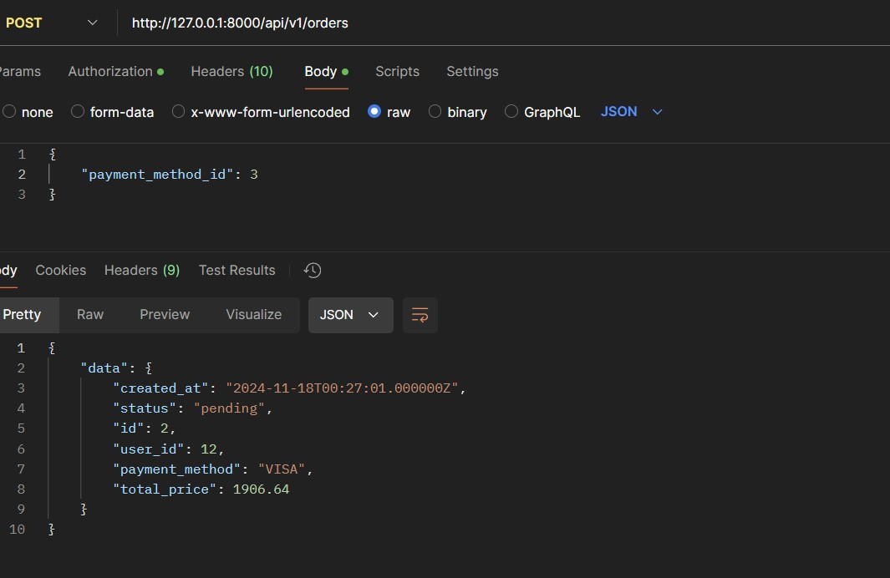
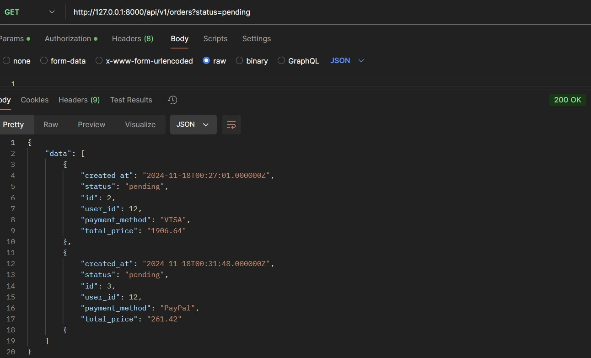

1\. Регистрация пользователя

2\. Авторизация пользователя

3\. Выход (logout) пользователя

4\. Получить список товаров

5\. Получить товар по id

6\. Добавление товара в корзину пользователя

7\. Удалить товар из корзины

8\. Получить корзину пользователя

9\. Получить список способов оплаты

10\. Создать заказ (оплатить корзину)

11\. Получить список заказов пользователя,  сортировка по умолчанию ‘asc’

11\. 1 Получить список заказов пользователя,  сортировка ‘desc’

11\.2 Фильтрация по статусу ‘pending’

11\. 3 Сортировка по дате создания ‘asc’ и фильтрация по статусу ‘paid’

12\. Получить заказ по ‘ID’

13 Обновить статус заказа на ‘Оплачен’

14\. Обновление статуса заказа с ‘На оплату’ в ‘Отменен’, при неоплате его более 2 минут (Job)

15\. Unit Test

